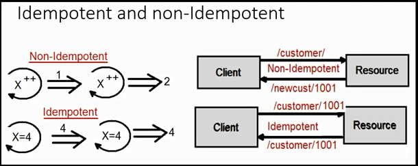
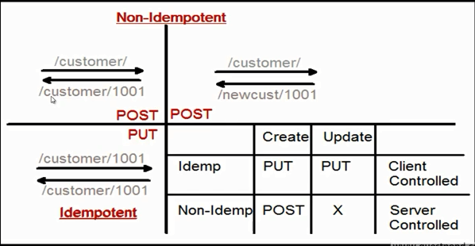

## Post vs Put

Post: Add a new resource<br/>
Put: Add new / Update a resource<br/>




If Non-Idempotent then Post (Server side control)<br/>
If Idempotetnt then Put (Client Side control)<br/>


## Put vs Patch

Put: Put is for full updates<br/>
patch: patch is for customized updates<br/>

```C#
Request Example 1
http://Customer/1001 (Put) -->
{
  Name: "Sujit"
  Amount: 100
}
```
```C#
Request Example 2
http://Customer/1001 (Patch) -->
{
  Name: "Sujit"
}
```